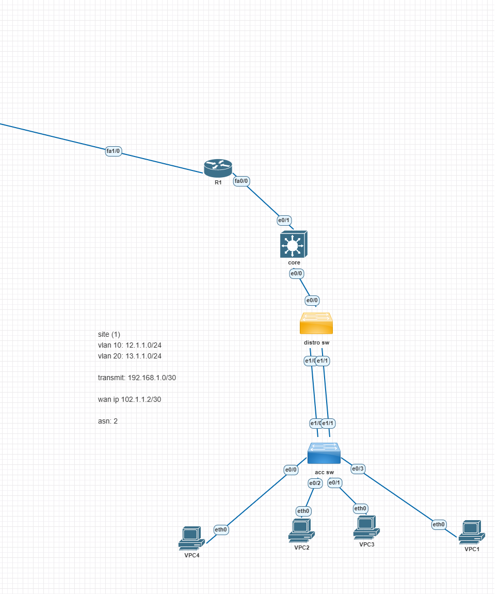

# Multi-Site Networking Lab

## Introduction
This lab simulates a multi-site network infrastructure with VLAN segmentation, spanning tree configuration, dynamic and static routing, and BGP-based inter-site communication. The setup includes two sites, each with core, distribution, and access switches, and a site router connecting to a central core router.

## Objectives
- Implement VLAN segmentation and inter-VLAN routing.
- Configure Rapid Spanning Tree Protocol (RSTP) with core switches as root.
- Set up static routing (Site 1) and OSPF (Site 2) between core switches and site routers.
- Establish BGP peering between site routers and the core router.
- Ensure redundancy and efficient traffic flow through link aggregation.
- Verify network connectivity and troubleshoot common issues.

## Lab Topology
### Network Overview

- **Site 1:**
  - VLAN 10: `12.1.1.0/24`
  - VLAN 20: `13.1.1.0/24`
  - Transmit (Core to Router): `192.168.1.0/30`
  - WAN Network (to Core Router): `102.1.1.2/30`

- **Site 2:**
  - VLAN 10: `14.1.1.0/24`
  - VLAN 20: `15.1.1.0/24`
  - Transmit (Core to Router): `192.168.2.0/30`
  - WAN Network (to Core Router): `103.1.1.2/30`

### Network Components
#### 1. Access Layer
- Each site contains access switches connecting VPCs.
- Access switches use trunk and access ports for VLAN segmentation.

#### 2. Distribution Layer
- Distribution switches aggregate traffic from access switches.
- Implemented channel-group configurations for link aggregation.

#### 3. Core Layer
- Core switches perform Layer 3 inter-VLAN routing.
- Implemented SVIs for VLAN routing.
- Configured Rapid Spanning Tree (RSTP) with core switches as root.
- Enabled portfast and BPDU guard on access ports.

#### 4. Site Routers
- Site 1: Static routing between core switch and site router.
- Site 2: OSPF used between core switch and site router.

#### 5. Core Router
- Connects both site routers using BGP.
- Advertises site networks for inter-site communication.

## Verification Commands

### VLAN and Spanning Tree
- `show vlan brief`  
- `show spanning-tree summary`  
- `show spanning-tree root`  

### Inter-VLAN Routing
- `show ip interface brief`  
- `show ip route`  

### OSPF Verification (Site 2)
- `show ip ospf neighbor`  
- `show ip ospf database`  

### BGP Verification (Core Router)
- `show ip bgp summary`  
- `show ip bgp neighbors`  

### Connectivity Testing
- `ping <destination IP>`  
- `traceroute <destination IP>`  

## Lab Files
- The full [UNI file](./network-lab.uni) for this lab is included in this repository.  
  You can use it to load the lab directly into **pNETLab**.

## Lab Requirements
To run this lab, ensure the following hardware and software requirements are met:

### Software
- **pNETLab** (to emulate networking devices)

### Hardware
- **CPU:** 4 processors or 2 cores with 2 processors
- **RAM:** 4GB minimum
- **Storage:** 20GB disk space

This setup is designed to showcase enterprise networking concepts and can be used as a portfolio project demonstrating proficiency in networking design, spanning tree, routing protocols, and BGP implementation.

